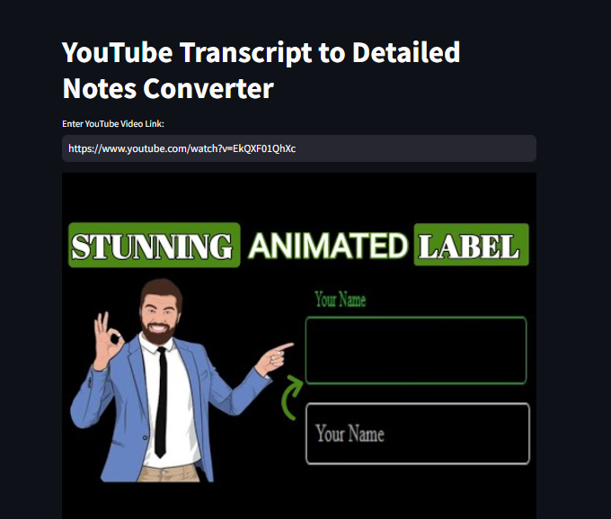
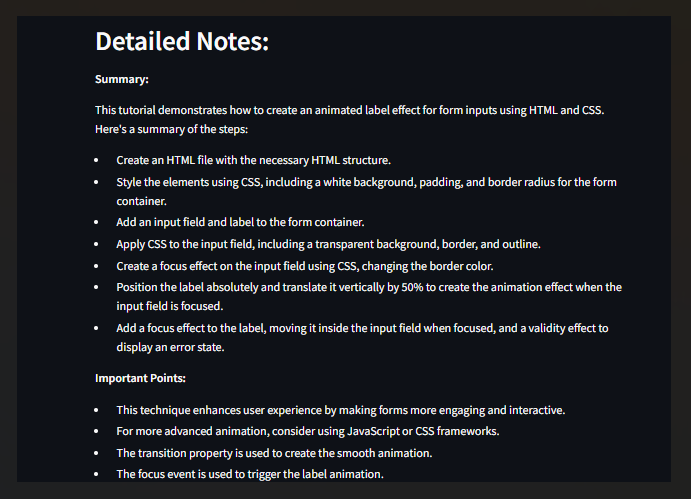

# YouTube Transcript to Detailed Notes Converter

This project is a Streamlit application that extracts transcripts from YouTube videos and summarizes them into detailed notes using Google's Gemini Pro AI model. The app helps users quickly capture the essential points of a YouTube video by providing a concise summary.

## Features

- **Transcript Extraction**: Fetches the full transcript of a YouTube video using its URL.
- **AI-Powered Summary**: Generates a detailed summary of the video transcript using Google Gemini Pro.
- **User Interface**: Simple and user-friendly interface built with Streamlit.
- **Dynamic Thumbnail Display**: Displays the thumbnail of the YouTube video for easy identification.

## Screenshots

### Input Section


### Output Section


## How It Works

1. **Input YouTube URL**: Enter the URL of the YouTube video you want to summarize.
2. **Transcript Extraction**: The app fetches the transcript of the video using the `youtube_transcript_api`.
3. **AI Summary Generation**: The transcript is then summarized into detailed notes using Google's Gemini Pro AI model.
4. **Display Summary**: The app displays the summary directly on the web interface.

## Installation

To run this application locally, follow these steps:

1. **Clone the repository**:

   ```bash
   git clone https://github.com/Niru8449/Summify.git
   cd youtube-transcript-summarizer
   
2. **Install the required dependencies**:
   ```bash
   pip install -r requirements.txt
   
3. **Set up environment variables** :

- Create a `.env` file in the project root directory and add your Google API key:

  ```plaintext
  GOOGLE_API_KEY=your_google_api_key_here

4. **Run the application**:

   ```bash
   streamlit run app.py

# Dependencies

- **streamlit**: For building the web interface.
- **youtube_transcript_api**: To extract transcripts from YouTube videos.
- **google-generativeai**: To generate summaries using Google's Gemini Pro.
- **python-dotenv**: To manage environment variables.

# Usage

1. **Start the App**: Run the Streamlit app and navigate to the provided local URL, or use the online version.

2. **Input the YouTube Link**: Enter the full YouTube video URL in the input field.

3. **Get Summary**: Click on "Get Detailed Notes" to fetch the transcript and generate the summary.

4. **View Results**: The detailed summary of the video will be displayed below.
